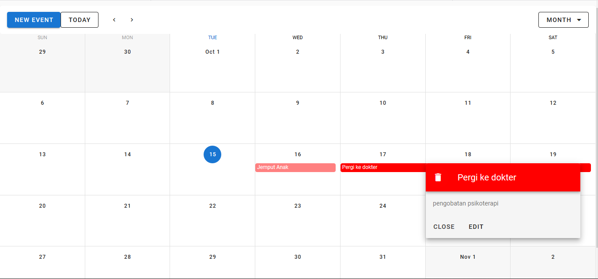

# vuecal

## Project setup
```
npm install
```

### Compiles and hot-reloads for development
```
npm run serve
```

### Compiles and minifies for production
```
npm run build
```

### Run your tests
```
npm run test
```

### Lints and fixes files
```
npm run lint
```

### Setting Up Firebase

1. Set up a new project in Firebase with Database enabled.
2. Implement the following Firebase SDK scripts in main.js:

```
import firebase from "firebase";
firebase.initializeApp({
  apiKey: "",
  authDomain: "",
  databaseURL: "",
  projectId: "",
  storageBucket: "",
  messagingSenderId: "",
  appId: ""
});

export const db = firebase.firestore();
```

## ScreenShoot


Enjoy the demo! Submit an issue if you see anything that could be improved!
